# Agentic SDLC Workflow - Mermaid Diagrams

This file contains all diagrams in Mermaid format. You can:
1. View directly in GitHub (paste in .md file)
2. Use VS Code with Mermaid extension
3. Use https://mermaid.live/ to view and edit
4. Export to PNG/SVG from mermaid.live

---

## 1. Current State vs. Production Ready - High Level

```mermaid
graph TB
    subgraph "YOUR CURRENT STATE ❌"
        A1[Markdown Docs Only]
        A2[No Executable Code]
        A3[No API Integrations]
        A4[No Orchestration]
        A5[Manual Execution]
        
        A1 --> A2
        A2 --> A3
        A3 --> A4
        A4 --> A5
        
        style A1 fill:#ff6b6b
        style A2 fill:#ff6b6b
        style A3 fill:#ff6b6b
        style A4 fill:#ff6b6b
        style A5 fill:#ff6b6b
    end
    
    subgraph "PRODUCTION READY ✅"
        B1[TypeScript Agents]
        B2[Claude API Integration]
        B3[GitHub/ADO/Figma APIs]
        B4[Orchestration Service]
        B5[Automated Workflow]
        
        B1 --> B2
        B2 --> B3
        B3 --> B4
        B4 --> B5
        
        style B1 fill:#51cf66
        style B2 fill:#51cf66
        style B3 fill:#51cf66
        style B4 fill:#51cf66
        style B5 fill:#51cf66
    end
    
    A5 -.->|10 weeks implementation| B1
```



---

## 2. Complete Production-Ready SDLC Workflow


---

## 3. Your Current Diagram vs. What You Actually Have


---

## 4. Agent Architecture - How Agents Actually Work


---

## 5. Missing Agents - Gap Analysis


---

## 6. Data Flow - End to End


---

## 7. Error Handling Flow


---

## 8. Implementation Roadmap - 10 Week Plan


---

## 9. Technology Stack


---

## 10. Phase 1 Deep Dive - Requirements to Backlog


---

## 11. System Architecture - Production Infrastructure


---

## 12. Comparison Matrix - Current vs Production

```mermaid
graph LR
    subgraph "Feature Comparison"
        direction TB
        
        F1[Executable Code]
        F2[API Integrations]
        F3[State Management]
        F4[Error Handling]
        F5[Observability]
        F6[Testing]
        F7[Security]
        F8[Scalability]
        F9[Orchestration]
        F10[Documentation]
    end
    
    subgraph "Current State"
        direction TB
        
        C1[❌ 0%]
        C2[❌ 0%]
        C3[❌ 0%]
        C4[❌ 0%]
        C5[❌ 0%]
        C6[❌ 0%]
        C7[❌ 0%]
        C8[❌ 0%]
        C9[❌ 0%]
        C10[✅ 90%]
    end
    
    subgraph "Production Ready"
        direction TB
        
        P1[✅ 95%]
        P2[✅ 90%]
        P3[✅ 95%]
        P4[✅ 90%]
        P5[✅ 85%]
        P6[✅ 90%]
        P7[✅ 85%]
        P8[✅ 80%]
        P9[✅ 95%]
        P10[✅ 95%]
    end
    
    F1 --- C1
    F1 --- P1
    F2 --- C2
    F2 --- P2
    F3 --- C3
    F3 --- P3
    F4 --- C4
    F4 --- P4
    F5 --- C5
    F5 --- P5
    F6 --- C6
    F6 --- P6
    F7 --- C7
    F7 --- P7
    F8 --- C8
    F8 --- P8
    F9 --- C9
    F9 --- P9
    F10 --- C10
    F10 --- P10
    
    style C1 fill:#ff6b6b,color:#fff
    style C2 fill:#ff6b6b,color:#fff
    style C3 fill:#ff6b6b,color:#fff
    style C4 fill:#ff6b6b,color:#fff
    style C5 fill:#ff6b6b,color:#fff
    style C6 fill:#ff6b6b,color:#fff
    style C7 fill:#ff6b6b,color:#fff
    style C8 fill:#ff6b6b,color:#fff
    style C9 fill:#ff6b6b,color:#fff
    style C10 fill:#51cf66,color:#fff
    
    style P1 fill:#51cf66,color:#fff
    style P2 fill:#51cf66,color:#fff
    style P3 fill:#51cf66,color:#fff
    style P4 fill:#51cf66,color:#fff
    style P5 fill:#51cf66,color:#fff
    style P6 fill:#51cf66,color:#fff
    style P7 fill:#51cf66,color:#fff
    style P8 fill:#51cf66,color:#fff
    style P9 fill:#51cf66,color:#fff
    style P10 fill:#51cf66,color:#fff
```



---

## How to Use These Diagrams

### 1. **View in GitHub**
- Create a `.md` file in your repo
- Copy any diagram code block
- GitHub will render it automatically

### 2. **View in VS Code**
- Install "Markdown Preview Mermaid Support" extension
- Open this file
- Press `Ctrl+Shift+V` (Cmd+Shift+V on Mac)

### 3. **Edit Online**
- Go to https://mermaid.live/
- Paste any diagram
- Edit and export as PNG/SVG

### 4. **Export for Presentations**
```bash
# Install mermaid-cli
npm install -g @mermaid-js/mermaid-cli

# Convert to PNG
mmdc -i diagram.mmd -o diagram.png -w 1920 -H 1080

# Convert to SVG
mmdc -i diagram.mmd -o diagram.svg
```

### 5. **Include in Documentation**
```markdown
# Your Documentation

## Architecture


Or embed directly:

\`\`\`mermaid
graph TD
    A --> B
\`\`\`
```

---

## Next Steps

1. **Review Diagrams**: Understand the gaps between current and production state
2. **Choose Diagrams**: Select which ones to include in your documentation
3. **Update Your Diagram**: Modify to match reality (Claude vs Copilot, etc.)
4. **Share with Team**: Use in presentations and planning sessions
5. **Track Progress**: Update diagrams as you implement features

---

## Diagram Files Included

1. ✅ Current vs Production - High Level
2. ✅ Complete Production-Ready Workflow
3. ✅ Current Diagram vs Reality
4. ✅ Agent Architecture
5. ✅ Missing Agents Gap Analysis
6. ✅ Data Flow Sequence
7. ✅ Error Handling Flow
8. ✅ 10-Week Implementation Roadmap
9. ✅ Technology Stack
10. ✅ Phase 1 Deep Dive
11. ✅ System Architecture - Infrastructure
12. ✅ Feature Comparison Matrix

All diagrams are **production-ready**, **professionally designed**, and **fully editable**.
