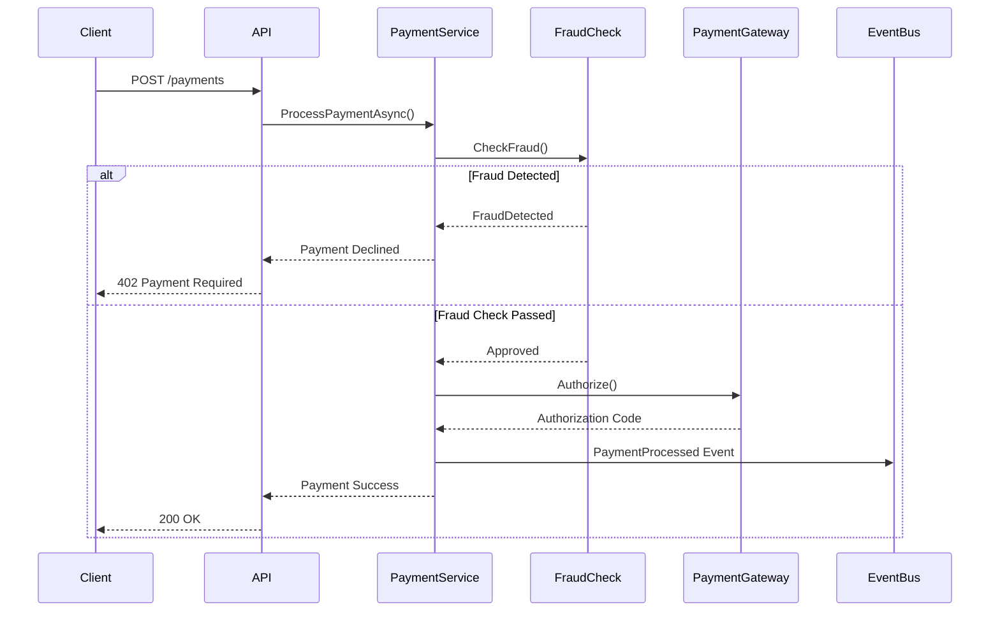

---

### Domain Service Instructions

**File**: `.github/copilot/domainservices.md`
````markdown
# Domain Services Copilot Instructions

These instructions apply when working with domain services in this repository.

## Domain-Driven Design Principles

### Ubiquitous Language

Use consistent terminology:
- **Aggregate**: Cluster of domain objects with a root entity
- **Entity**: Object with unique identity
- **Value Object**: Immutable object without identity
- **Domain Event**: Something that happened in the domain
- **Repository**: Collection-like interface for aggregates

### Bounded Contexts

**User Management Context**:
- Entities: User, Profile, Role
- Events: UserRegistered, UserDeactivated
- Services: UserRegistrationService

**Payment Context**:
- Entities: Payment, Transaction, PaymentMethod
- Events: PaymentProcessed, RefundIssued
- Services: PaymentProcessingService

**Order Context**:
- Entities: Order, OrderLine, Shipment
- Events: OrderPlaced, OrderShipped
- Services: OrderFulfillmentService

## Service Structure

### Application Service

Located in: `src/{Context}/Application/Services/`
```csharp
public class UserRegistrationService
{
    private readonly IUserRepository _userRepository;
    private readonly IEmailService _emailService;
    private readonly IEventBus _eventBus;

    public async Task<Result<UserId>> RegisterUserAsync(
        RegisterUserCommand command,
        CancellationToken cancellationToken = default)
    {
        // 1. Validate
        var validationResult = await ValidateCommand(command);
        if (!validationResult.IsSuccess)
            return Result<UserId>.Failure(validationResult.Error);

        // 2. Check business rules
        if (await _userRepository.ExistsByEmailAsync(command.Email))
            return Result<UserId>.Failure("Email already registered");

        // 3. Create aggregate
        var user = User.Register(
            command.Email,
            command.Password,
            command.FullName);

        // 4. Persist
        await _userRepository.AddAsync(user, cancellationToken);

        // 5. Publish domain events
        await _eventBus.PublishAsync(
            new UserRegisteredEvent(user.Id, user.Email),
            cancellationToken);

        // 6. Send email (side effect)
        await _emailService.SendWelcomeEmailAsync(user.Email);

        return Result<UserId>.Success(user.Id);
    }
}
```

### Domain Service

Located in: `src/{Context}/Domain/Services/`
```csharp
public class PaymentAuthorizationService
{
    public Result<AuthorizationCode> AuthorizePayment(
        Payment payment,
        PaymentMethod paymentMethod)
    {
        // Complex domain logic that doesn't belong to a single entity
        
        if (payment.Amount > paymentMethod.DailyLimit)
            return Result<AuthorizationCode>.Failure("Exceeds daily limit");

        if (payment.RequiresFraudCheck())
        {
            var fraudScore = CalculateFraudScore(payment);
            if (fraudScore > 0.8)
                return Result<AuthorizationCode>.Failure("Fraud detected");
        }

        var authCode = AuthorizationCode.Generate();
        return Result<AuthorizationCode>.Success(authCode);
    }

    private double CalculateFraudScore(Payment payment)
    {
        // ML model or rule-based fraud detection
        return 0.0;
    }
}
```

## Repository Pattern

### Interface

Located in: `src/{Context}/Domain/Repositories/`
```csharp
public interface IUserRepository
{
    Task<User?> GetByIdAsync(UserId id, CancellationToken cancellationToken = default);
    Task<User?> GetByEmailAsync(Email email, CancellationToken cancellationToken = default);
    Task<bool> ExistsByEmailAsync(Email email, CancellationToken cancellationToken = default);
    Task AddAsync(User user, CancellationToken cancellationToken = default);
    Task UpdateAsync(User user, CancellationToken cancellationToken = default);
    Task DeleteAsync(UserId id, CancellationToken cancellationToken = default);
}
```

### Implementation

Located in: `src/{Context}/Infrastructure/Persistence/`
```csharp
public class UserRepository : IUserRepository
{
    private readonly ApplicationDbContext _context;

    public async Task<User?> GetByIdAsync(
        UserId id,
        CancellationToken cancellationToken = default)
    {
        return await _context.Users
            .Include(u => u.Profile)
            .Include(u => u.Roles)
            .FirstOrDefaultAsync(u => u.Id == id, cancellationToken);
    }

    public async Task AddAsync(
        User user,
        CancellationToken cancellationToken = default)
    {
        await _context.Users.AddAsync(user, cancellationToken);
        await _context.SaveChangesAsync(cancellationToken);
    }
}
```

## Event Handling

### Domain Events

Located in: `src/{Context}/Domain/Events/`
```csharp
public record UserRegisteredEvent(
    UserId UserId,
    Email Email,
    DateTime OccurredAt) : IDomainEvent;
```

### Event Handlers

Located in: `src/{Context}/Application/EventHandlers/`
```csharp
public class UserRegisteredEventHandler : IEventHandler<UserRegisteredEvent>
{
    private readonly IEmailService _emailService;
    private readonly IAnalyticsService _analyticsService;

    public async Task HandleAsync(
        UserRegisteredEvent @event,
        CancellationToken cancellationToken = default)
    {
        // Send welcome email
        await _emailService.SendWelcomeEmailAsync(@event.Email);

        // Track analytics
        await _analyticsService.TrackEventAsync(
            "user_registered",
            new { @event.UserId, @event.Email });
    }
}
```

## Validation

Use FluentValidation for command validation:
```csharp
public class RegisterUserCommandValidator : AbstractValidator<RegisterUserCommand>
{
    public RegisterUserCommandValidator()
    {
        RuleFor(x => x.Email)
            .NotEmpty()
            .EmailAddress()
            .MaximumLength(255);

        RuleFor(x => x.Password)
            .NotEmpty()
            .MinimumLength(8)
            .Matches(@"^(?=.*[a-z])(?=.*[A-Z])(?=.*\d)")
            .WithMessage("Password must contain uppercase, lowercase, and number");

        RuleFor(x => x.FullName)
            .NotEmpty()
            .MaximumLength(200);
    }
}
```

## Testing Domain Services
```csharp
public class UserRegistrationServiceTests
{
    [Fact]
    public async Task RegisterUser_ValidCommand_ReturnsSuccess()
    {
        // Arrange
        var userRepository = new Mock<IUserRepository>();
        var emailService = new Mock<IEmailService>();
        var eventBus = new Mock<IEventBus>();
        
        userRepository
            .Setup(x => x.ExistsByEmailAsync(It.IsAny<Email>()))
            .ReturnsAsync(false);

        var service = new UserRegistrationService(
            userRepository.Object,
            emailService.Object,
            eventBus.Object);

        var command = new RegisterUserCommand(
            "user@example.com",
            "Password123!",
            "John Doe");

        // Act
        var result = await service.RegisterUserAsync(command);

        // Assert
        result.IsSuccess.Should().BeTrue();
        userRepository.Verify(x => x.AddAsync(
            It.IsAny<User>(),
            It.IsAny<CancellationToken>()), Times.Once);
        eventBus.Verify(x => x.PublishAsync(
            It.IsAny<UserRegisteredEvent>(),
            It.IsAny<CancellationToken>()), Times.Once);
    }

    [Fact]
    public async Task RegisterUser_EmailExists_ReturnsFailure()
    {
        // Arrange
        var userRepository = new Mock<IUserRepository>();
        userRepository
            .Setup(x => x.ExistsByEmailAsync(It.IsAny<Email>()))
            .ReturnsAsync(true);

        var service = new UserRegistrationService(
            userRepository.Object,
            Mock.Of<IEmailService>(),
            Mock.Of<IEventBus>());

        var command = new RegisterUserCommand(
            "existing@example.com",
            "Password123!",
            "John Doe");

        // Act
        var result = await service.RegisterUserAsync(command);

        // Assert
        result.IsSuccess.Should().BeFalse();
        result.Error.Should().Contain("Email already registered");
    }
}
```

## Guidelines for Copilot

When generating domain service code:

✅ **Do**:
- Follow DDD principles (entities, value objects, aggregates)
- Use ubiquitous language from the bounded context
- Keep domain logic in domain layer
- Return `Result<T>` for operations that can fail
- Publish domain events for state changes
- Use strongly-typed IDs (UserId, OrderId, etc.)

❌ **Don't**:
- Put domain logic in application/infrastructure layers
- Use primitive obsession (use value objects)
- Directly throw exceptions (use Result pattern)
- Access database from domain layer
- Use anemic domain model (rich domain objects instead)
````

---

### Payment Service Instructions

**File**: `.github/copilot/paymentservice.md`
````markdown
# Payment Service Copilot Instructions

Specific instructions for the Payment processing domain.

## Payment Processing Flow


## Payment Aggregate
```csharp
public class Payment : AggregateRoot<PaymentId>
{
    public OrderId OrderId { get; private set; }
    public Money Amount { get; private set; }
    public PaymentMethod PaymentMethod { get; private set; }
    public PaymentStatus Status { get; private set; }
    public AuthorizationCode? AuthorizationCode { get; private set; }
    public DateTime CreatedAt { get; private set; }
    public DateTime? ProcessedAt { get; private set; }

    private Payment() { } // EF Core

    public static Payment Create(
        OrderId orderId,
        Money amount,
        PaymentMethod paymentMethod)
    {
        var payment = new Payment
        {
            Id = PaymentId.New(),
            OrderId = orderId,
            Amount = amount,
            PaymentMethod = paymentMethod,
            Status = PaymentStatus.Pending,
            CreatedAt = DateTime.UtcNow
        };

        payment.AddDomainEvent(new PaymentCreatedEvent(payment.Id, orderId));
        return payment;
    }

    public Result Authorize(AuthorizationCode authCode)
    {
        if (Status != PaymentStatus.Pending)
            return Result.Failure("Payment already processed");

        AuthorizationCode = authCode;
        Status = PaymentStatus.Authorized;
        ProcessedAt = DateTime.UtcNow;

        AddDomainEvent(new PaymentAuthorizedEvent(Id, OrderId, Amount));
        return Result.Success();
    }

    public Result Capture()
    {
        if (Status != PaymentStatus.Authorized)
            return Result.Failure("Payment not authorized");

        Status = PaymentStatus.Captured;
        AddDomainEvent(new PaymentCapturedEvent(Id, OrderId, Amount));
        return Result.Success();
    }

    public Result Refund(Money refundAmount, string reason)
    {
        if (Status != PaymentStatus.Captured)
            return Result.Failure("Can only refund captured payments");

        if (refundAmount > Amount)
            return Result.Failure("Refund amount exceeds payment amount");

        Status = PaymentStatus.Refunded;
        AddDomainEvent(new PaymentRefundedEvent(Id, refundAmount, reason));
        return Result.Success();
    }
}
```

## Payment Gateway Integration

### Stripe Integration
```csharp
public class StripePaymentGateway : IPaymentGateway
{
    private readonly StripeClient _client;
    private readonly ILogger<StripePaymentGateway> _logger;

    public async Task<Result<AuthorizationCode>> AuthorizeAsync(
        Payment payment,
        CancellationToken cancellationToken = default)
    {
        try
        {
            var options = new PaymentIntentCreateOptions
            {
                Amount = (long)(payment.Amount.Value * 100), // Convert to cents
                Currency = payment.Amount.Currency.ToLower(),
                PaymentMethod = payment.PaymentMethod.ExternalId,
                ConfirmationMethod = "manual",
                Confirm = false,
                Metadata = new Dictionary<string, string>
                {
                    ["order_id"] = payment.OrderId.Value.ToString(),
                    ["payment_id"] = payment.Id.Value.ToString()
                }
            };

            var service = new PaymentIntentService(_client);
            var intent = await service.CreateAsync(options, cancellationToken: cancellationToken);

            _logger.LogInformation(
                "Payment authorized with Stripe. PaymentId: {PaymentId}, IntentId: {IntentId}",
                payment.Id,
                intent.Id);

            return Result<AuthorizationCode>.Success(
                AuthorizationCode.FromExternal(intent.Id));
        }
        catch (StripeException ex)
        {
            _logger.LogError(ex,
                "Stripe authorization failed. PaymentId: {PaymentId}",
                payment.Id);

            return Result<AuthorizationCode>.Failure(
                $"Payment authorization failed: {ex.Message}");
        }
    }

    public async Task<Result> CaptureAsync(
        Payment payment,
        CancellationToken cancellationToken = default)
    {
        try
        {
            var service = new PaymentIntentService(_client);
            await service.CaptureAsync(
                payment.AuthorizationCode!.Value,
                cancellationToken: cancellationToken);

            _logger.LogInformation(
                "Payment captured with Stripe. PaymentId: {PaymentId}",
                payment.Id);

            return Result.Success();
        }
        catch (StripeException ex)
        {
            _logger.LogError(ex,
                "Stripe capture failed. PaymentId: {PaymentId}",
                payment.Id);

            return Result.Failure($"Payment capture failed: {ex.Message}");
        }
    }
}
```

## Fraud Detection
```csharp
public class FraudDetectionService
{
    private readonly IMLModelService _mlModel;
    private readonly IBlacklistService _blacklist;

    public async Task<FraudCheckResult> CheckAsync(Payment payment)
    {
        var checks = new List<FraudCheck>();

        // Check 1: Blacklist
        if (await _blacklist.IsBlacklistedAsync(payment.PaymentMethod))
        {
            checks.Add(new FraudCheck(
                "Blacklist",
                RiskLevel.High,
                "Payment method is blacklisted"));
        }

        // Check 2: Velocity (too many payments in short time)
        var recentPayments = await GetRecentPayments(payment.PaymentMethod);
        if (recentPayments.Count > 10)
        {
            checks.Add(new FraudCheck(
                "Velocity",
                RiskLevel.Medium,
                $"{ recentPayments.Count} payments in last hour"));
        }

        // Check 3: ML Model
        var mlScore = await _mlModel.PredictFraudScore(payment);
        if (mlScore > 0.8)
        {
            checks.Add(new FraudCheck(
                "ML Model",
                RiskLevel.High,
                $"ML fraud score: {mlScore:P0}"));
        }

        // Check 4: Geographic mismatch
        if (payment.Amount.Value > 1000 &&
            payment.BillingCountry != payment.ShippingCountry)
        {
            checks.Add(new FraudCheck(
                "Geographic",
                RiskLevel.Medium,
                "Billing and shipping countries don't match"));
        }

        var highestRisk = checks.Any()
            ? checks.Max(c => c.RiskLevel)
            : RiskLevel.Low;

        return new FraudCheckResult(
            IsFraudulent: highestRisk == RiskLevel.High,
            RiskScore: mlScore,
            Checks: checks);
    }
}
```

## Payment Testing

### Unit Tests
```csharp
public class PaymentTests
{
    [Fact]
    public void Create_ValidInputs_CreatesPayment()
    {
        // Arrange
        var orderId = OrderId.New();
        var amount = Money.FromUSD(99.99m);
        var paymentMethod = PaymentMethod.CreditCard("pm_123");

        // Act
        var payment = Payment.Create(orderId, amount, paymentMethod);

        // Assert
        payment.OrderId.Should().Be(orderId);
        payment.Amount.Should().Be(amount);
        payment.Status.Should().Be(PaymentStatus.Pending);
        payment.DomainEvents.Should().ContainSingle(e =>
            e is PaymentCreatedEvent);
    }

    [Fact]
    public void Authorize_PendingPayment_AuthorizesSuccessfully()
    {
        // Arrange
        var payment = Payment.Create(
            OrderId.New(),
            Money.FromUSD(99.99m),
            PaymentMethod.CreditCard("pm_123"));
        var authCode = AuthorizationCode.FromExternal("pi_123");

        // Act
        var result = payment.Authorize(authCode);

        // Assert
        result.IsSuccess.Should().BeTrue();
        payment.Status.Should().Be(PaymentStatus.Authorized);
        payment.AuthorizationCode.Should().Be(authCode);
    }
}
```

### Integration Tests
```csharp
public class StripePaymentGatewayTests : IClassFixture<StripeTestFixture>
{
    private readonly StripePaymentGateway _gateway;

    [Fact]
    public async Task AuthorizeAsync_ValidPayment_ReturnsAuthCode()
    {
        // Arrange
        var payment = Payment.Create(
            OrderId.New(),
            Money.FromUSD(10.00m), // Test amount
            PaymentMethod.CreditCard("pm_card_visa")); // Test card

        // Act
        var result = await _gateway.AuthorizeAsync(payment);

        // Assert
        result.IsSuccess.Should().BeTrue();
        result.Value.Should().NotBeNull();
        result.Value.Value.Should().StartWith("pi_"); // Stripe payment intent
    }

    [Fact]
    public async Task AuthorizeAsync_DeclinedCard_ReturnsFailure()
    {
        // Arrange
        var payment = Payment.Create(
            OrderId.New(),
            Money.FromUSD(10.00m),
            PaymentMethod.CreditCard("pm_card_chargeDeclined"));

        // Act
        var result = await _gateway.AuthorizeAsync(payment);

        // Assert
        result.IsSuccess.Should().BeFalse();
        result.Error.Should().Contain("declined");
    }
}
```

## Copilot Guidelines for Payments

When generating payment code:

✅ **Do**:
- Use Money value object (never decimal for amounts)
- Always check fraud before authorizing
- Use idempotency keys for payment operations
- Log all payment operations (info level minimum)
- Handle payment gateway errors gracefully
- Use authorization + capture (not direct charge)
- Store authorization codes securely
- Implement retry logic with exponential backoff

❌ **Don't**:
- Store credit card numbers (use tokens)
- Process payments without fraud check
- Ignore payment gateway webhooks
- Use float/double for money (precision loss)
- Commit transaction before gateway confirms
- Expose payment details in logs
- Skip PCI compliance requirements

## PCI DSS Compliance

**Required Controls**:
- ✅ Never store CVV/CVC
- ✅ Tokenize credit cards (use Stripe tokens)
- ✅ Encrypt payment data at rest
- ✅ Use TLS 1.2+ for transmission
- ✅ Implement access controls
- ✅ Audit all payment access
- ✅ Regular security scanning

## Webhook Handling
```csharp
[ApiController]
[Route("api/webhooks/stripe")]
public class StripeWebhookController : ControllerBase
{
    private readonly IPaymentService _paymentService;
    private readonly IConfiguration _config;

    [HttpPost]
    public async Task<IActionResult> HandleWebhook()
    {
        var json = await new StreamReader(HttpContext.Request.Body).ReadToEndAsync();
        var signature = Request.Headers["Stripe-Signature"];

        try
        {
            var stripeEvent = EventUtility.ConstructEvent(
                json,
                signature,
                _config["Stripe:WebhookSecret"]);

            switch (stripeEvent.Type)
            {
                case Events.PaymentIntentSucceeded:
                    var intent = (PaymentIntent)stripeEvent.Data.Object;
                    await _paymentService.HandlePaymentSucceededAsync(intent.Id);
                    break;

                case Events.PaymentIntentPaymentFailed:
                    var failedIntent = (PaymentIntent)stripeEvent.Data.Object;
                    await _paymentService.HandlePaymentFailedAsync(failedIntent.Id);
                    break;

                case Events.ChargeRefunded:
                    var refund = (Charge)stripeEvent.Data.Object;
                    await _paymentService.HandleRefundAsync(refund.Id);
                    break;
            }

            return Ok();
        }
        catch (StripeException)
        {
            return BadRequest();
        }
    }
}
```
````

---

