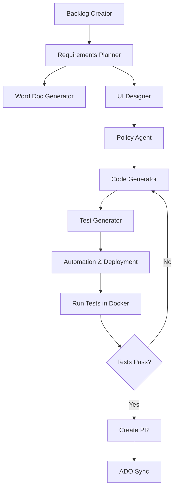

# Complete AI SDLC Workflow Guide

## Overview
This document describes the complete end-to-end workflow for the AI-powered Software Development Lifecycle using GitHub Copilot and VS Code.

## Workflow Phases



## Phase 1: Requirements Gathering

### 1.1 Backlog Creator Agent
**Input:** High-level business requirements  
**Output:** Structured user stories in `/backlog/`

**GitHub Copilot Instructions:**
```
@workspace /new Create user stories from the following requirements:
[Paste requirements here]

Generate stories following the format in /backlog/event-management-epics-p0-stories.md
Include acceptance criteria and story points.
```

### 1.2 Requirements Planner Agent
**Input:** User stories from backlog  
**Output:** Detailed specifications in `/docs/specs/`

**GitHub Copilot Instructions:**
```
@workspace Using the stories in /backlog/, create a detailed technical specification.
Follow the structure in /docs/specs/event-management-dynamics-crm-marketing-app-spec.md
Include architecture diagrams, data models, and API specifications.
```

### 1.3 Word Document Generator Agent (NEW)
**Input:** Markdown specifications  
**Output:** Professional Word documents in `/docs/word/`

**Execution:**
```bash
# Install dependencies
npm install docx markdown-it mammoth

# Generate Word document
npm run generate:word
```

**GitHub Copilot Instructions:**
```
@workspace Generate a Microsoft Word document from the specification at
/docs/specs/event-management-dynamics-crm-marketing-app-spec.md

Use the WordDocumentGenerator class to create a professionally formatted document
with table of contents, headers, tables, and styling.
```

## Phase 2: Design & Architecture

### 2.1 UI Designer Agent
**Input:** Requirements and user stories  
**Output:** UI mockups, component designs in `/design/`

**GitHub Copilot Instructions:**
```
@workspace Create React component designs for the event management system.
- Include Figma/mockup links
- Define component hierarchy
- Specify props and state management
- Create design system documentation
```

### 2.2 Policy Agent
**Input:** Design specifications  
**Output:** Coding standards, security policies in `.github/copilot/`

**GitHub Copilot Instructions:**
```
@workspace Review the design and create coding standards documentation.
Include:
- Security policies
- API design guidelines
- Data validation rules
- Error handling patterns
```

## Phase 3: Implementation

### 3.1 Code Generation Agent (NEW)
**Input:** Specifications, designs, and policies  
**Output:** Production code in `/src/`

**GitHub Copilot Instructions:**
```
@workspace /new Implement the EventService class based on the specification.
- Follow the patterns in /.github/copilot/
- Include error handling and logging
- Add JSDoc documentation
- Implement dependency injection
```

**Example Session:**
```typescript
// Create controller
@workspace Generate EventController with CRUD operations
// Copilot will generate based on templates and specifications

// Create service layer
@workspace Generate EventService with business logic for event registration
// Copilot will implement based on requirements

// Create repository
@workspace Generate EventRepository using TypeORM
// Copilot will create data access layer
```

**Verification:**
```bash
# Run linter
npm run lint

# Type check
npm run type-check

# Verify against policies
npm run policy-check
```

### 3.2 Test Generation Agent (NEW)
**Input:** Source code from `/src/`  
**Output:** Comprehensive tests in `/tests/`

**GitHub Copilot Instructions:**
```
@workspace Generate unit tests for EventService
- Achieve 80%+ coverage
- Include edge cases
- Test error scenarios
- Use AAA pattern (Arrange, Act, Assert)
```

**Execution:**
```bash
# Generate tests
npm run generate:tests

# Run tests
npm run test:unit
npm run test:integration
npm run test:coverage
```

## Phase 4: Automation & Deployment (NEW)

### 4.1 Docker Configuration
**Input:** Application code and dependencies  
**Output:** Docker files and compose configurations

**GitHub Copilot Instructions:**
```
@workspace Create Dockerfile for the Node.js application
- Multi-stage build
- Production optimized
- Security best practices
- Health checks included
```

**Files Generated:**
- `Dockerfile`
- `docker-compose.yml`
- `docker-compose.test.yml`
- `.dockerignore`

### 4.2 CI/CD Pipeline Setup
**Input:** Project structure  
**Output:** GitHub Actions workflows

**GitHub Copilot Instructions:**
```
@workspace Create GitHub Actions workflow for CI/CD
Include:
- Lint and test jobs
- Docker build and push
- E2E testing
- Automated PR creation on success
```

**Files Generated:**
- `.github/workflows/ci-cd.yml`
- `.github/workflows/pr-automation.yml`

### 4.3 Automation Scripts (NEW)
**Input:** Build and deployment requirements  
**Output:** Shell scripts in `/scripts/`

**GitHub Copilot Instructions:**
```
@workspace Create automation scripts for:
1. Build and test (build-and-test.sh)
2. Local Docker deployment (deploy-local.sh)
3. Database migrations (migrate.sh)
4. Pre-commit hooks (pre-commit.sh)
```

## Phase 5: Local Testing & Validation

### 5.1 Docker Deployment
```bash
# Build Docker images
./scripts/build-and-test.sh

# Start services locally
./scripts/deploy-local.sh

# Check service health
docker-compose ps
docker-compose logs -f app
```

### 5.2 Run Complete Test Suite
```bash
# Inside Docker container
docker-compose exec app npm run test:unit
docker-compose exec app npm run test:integration

# E2E tests
docker-compose run --rm test npm run test:e2e

# Coverage report
docker-compose exec app npm run test:coverage
```

### 5.3 Validation Checklist
- [ ] All unit tests passing (80%+ coverage)
- [ ] Integration tests passing
- [ ] E2E tests passing
- [ ] Linting successful
- [ ] Type checking successful
- [ ] Security scan clean
- [ ] Performance benchmarks met
- [ ] Docker services healthy

## Phase 6: PR Creation & Sync

### 6.1 Automated PR Creation
The CI/CD pipeline automatically creates a PR when all tests pass:

**Trigger Conditions:**
1. All tests pass ✅
2. Coverage threshold met ✅
3. Linting successful ✅
4. Security scan clean ✅

**GitHub Actions Workflow:**
```yaml
- name: Create Pull Request
  if: success()
  uses: peter-evans/create-pull-request@v5
  with:
    title: 'feat: Implement event management system'
    body: |
      ## Changes
      - ✅ Event registration API
      - ✅ CRM integration
      - ✅ Email notifications
      
      ## Test Results
      - Unit Tests: PASSED (87% coverage)
      - Integration Tests: PASSED
      - E2E Tests: PASSED
      
      ## Deployment
      - Docker image: ghcr.io/org/app:sha-abc123
      - Deployment ready: YES
```

### 6.2 ADO Sync Agent
**Input:** GitHub PR and commits  
**Output:** Synced work items in Azure DevOps

**Configuration:**
```yaml
# .github/workflows/ado-sync.yml
name: ADO Sync
on:
  pull_request:
    types: [opened, synchronize]

jobs:
  sync:
    runs-on: ubuntu-latest
    steps:
      - name: Sync to Azure DevOps
        uses: azure/boards-sync@v1
        with:
          ado-token: ${{ secrets.ADO_TOKEN }}
          github-token: ${{ secrets.GITHUB_TOKEN }}
          mapping: .github/ado-sync-mapping.yml
```

## Complete End-to-End Example

### Step-by-Step Execution

#### 1. Start with Requirements
```bash
# Create new feature branch
git checkout -b feature/event-registration

# Generate backlog stories
code .github/agents/backlog-creator.agent.md
# Use GitHub Copilot Chat with requirements
```

#### 2. Generate Specifications
```bash
# Generate markdown spec
@workspace Create technical specification for event registration

# Generate Word document
npm run generate:word
```

#### 3. Implement Features
```bash
# Generate code using Copilot
@workspace /new Implement event registration feature

# Files created:
# - src/controllers/event.controller.ts
# - src/services/event.service.ts
# - src/repositories/event.repository.ts
# - src/models/event.model.ts
```

#### 4. Generate Tests
```bash
# Auto-generate tests
@workspace Generate comprehensive tests for EventService

# Run tests locally
npm run test:coverage
```

#### 5. Setup Docker & CI/CD
```bash
# Generate Docker configuration
@workspace Create Docker setup for local development

# Generate CI/CD pipeline
@workspace Create GitHub Actions workflow with PR automation
```

#### 6. Deploy and Test Locally
```bash
# Build and start services
./scripts/deploy-local.sh

# Wait for services to be ready
# Run full test suite
docker-compose run --rm test

# Verify application
curl http://localhost:3000/health
```

#### 7. Push and Create PR
```bash
# Commit changes
git add .
git commit -m "feat: implement event registration system"

# Push to GitHub
git push origin feature/event-registration

# CI/CD pipeline will:
# 1. Run all tests
# 2. Build Docker image
# 3. Run E2E tests
# 4. Create PR automatically if successful
```

#### 8. PR Created Automatically
```
✅ Pull Request Created: #123

Title: feat: Implement event registration system

All checks passed:
- Tests: ✅ 87% coverage
- Lint: ✅ No issues
- Security: ✅ No vulnerabilities
- Docker Build: ✅ Success
- E2E Tests: ✅ All passed

Ready for review and merge.
```

## VS Code Configuration

### Required Extensions
```json
{
  "recommendations": [
    "github.copilot",
    "github.copilot-chat",
    "ms-azuretools.vscode-docker",
    "esbenp.prettier-vscode",
    "dbaeumer.vscode-eslint",
    "ms-playwright.playwright"
  ]
}
```

### Workspace Settings
```json
{
  "github.copilot.enable": {
    "*": true
  },
  "github.copilot.advanced": {
    "agentMode": true,
    "contextFiles": [
      ".github/copilot/**/*.md",
      ".github/agents/**/*.md",
      "docs/specs/**/*.md"
    ]
  }
}
```

## Monitoring & Observability

### Pipeline Dashboard
Monitor the AI SDLC pipeline:
- GitHub Actions: View workflow runs
- Coverage Reports: Codecov integration
- Docker Registry: ghcr.io
- Azure DevOps: Work item sync status

### Metrics to Track
- Time from backlog to PR: Target < 2 hours
- Test coverage: Target > 80%
- Build success rate: Target > 95%
- PR automation rate: Target 100%

## Troubleshooting

### Common Issues

#### Tests Failing in Docker
```bash
# Check logs
docker-compose logs app

# Restart services
docker-compose restart

# Rebuild with no cache
docker-compose build --no-cache
```

#### PR Not Created
Check workflow logs:
```bash
gh run list --workflow=ci-cd.yml
gh run view <run-id> --log
```

#### ADO Sync Issues
Verify token permissions and mapping configuration

## Next Steps

1. **Customize for Your Project**
   - Update agent prompts in `.github/agents/`
   - Modify templates to match your stack
   - Configure environment variables

2. **Extend Capabilities**
   - Add security scanning
   - Implement performance testing
   - Add monitoring/logging
   - Configure deployment to cloud

3. **Optimize Workflow**
   - Fine-tune Copilot context
   - Create custom code templates
   - Build reusable components library

## Summary

This complete AI SDLC workflow enables:
- ✅ Automated requirements to code generation
- ✅ Comprehensive test coverage
- ✅ Local Docker deployment
- ✅ Automated PR creation
- ✅ Azure DevOps synchronization
- ✅ Professional Word documentation

All phases are orchestrated through GitHub Copilot in VS Code, with clear handoffs between agents and automated validation at each step.